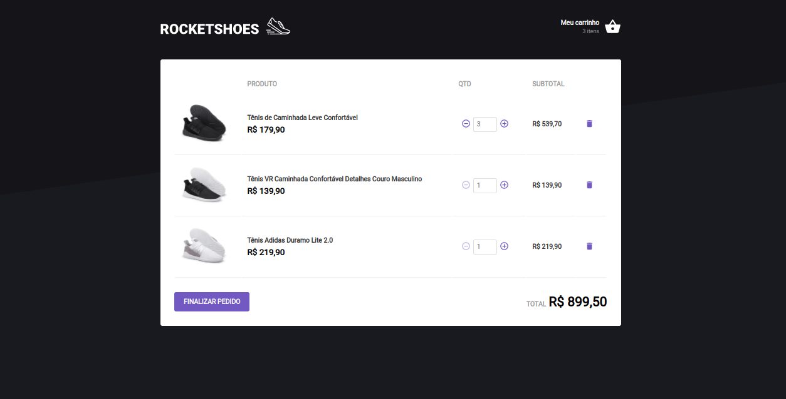

# RocketShoes

<h2>Descrição do Projeto</h2>
<p align="center">
Aplicação desenvolvida no  desafio Ignite React da Rocketseat Capítulo II - Desafio 01 - Criando um hook de carrinho de compras.

</p>

<h1 align="center">
  
</h1>
<h2>Pré-requisitos</h2>

Antes de começar, você vai precisar ter instalado em sua máquina as seguintes ferramentas:
[Git](https://git-scm.com) e [React](https://pt-br.reactjs.org/).
Além disto é bom ter um editor para trabalhar com o código como [VSCode](https://code.visualstudio.com/).

# 🎲 Rodando o Back-End

```bash
# Clone este repositório
$ git clone git@github.com:rosana-moreira/RocketShoes.git

# Acesse a pasta do projeto no terminal/cmd
 cd RocketShoes

# Instale as dependências
$ yarn

# Execute a aplicação em modo de desenvolvimento
$ yarn server

# O servidor do back-end inciará na porta:3333 - acesse <http://localhost:3333>

```

# 🎲 Rodando o Front-End

```bash

# Acesse a pasta do projeto no terminal/cmd
$ cd RocketShoes

# Abra um novo terminal e execute a aplicação em modo de desenvolvimento
$ yarn start

# O servidor do front-end inciará na porta:3000 - acesse <http://localhost:3000>
```
